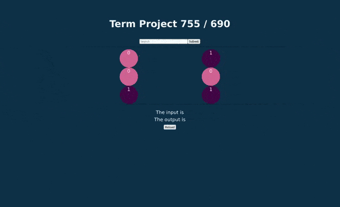

# Hopfield Network GUI

Hopfield Network Algorithm applied to neural network (ANN) for training image datasets (ex. MNIST).

**Technology stack**: Python, Flask, Node.js, JavaScript, CSS, React, Redux.

**Team members**: Austin, Molly, Albert

# Project Demo

 

# Description

The HNN GUI corrects your mispelled input words by using a neural network.

Please see the demo above as your words are being trained by our machine learning model.

# Contributing to the project

If interested please reach out to one our team members at Hello@HopfieldNetworkGUI

# Project Milestones

-   Compatibility with all major operating systems including Linux distributions

-   Cloud deployment
